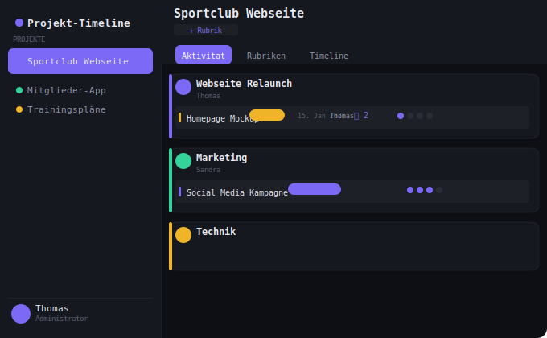
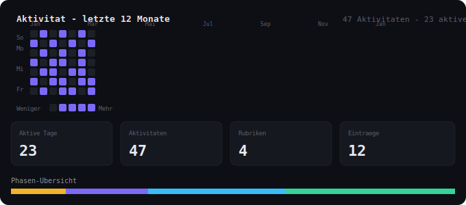
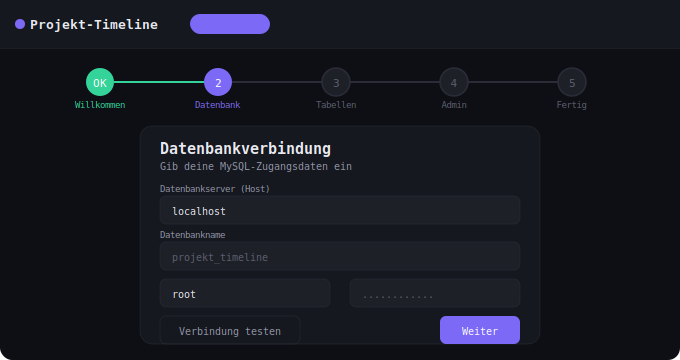
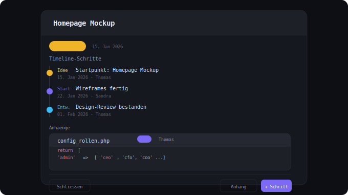

# Projekt-Timeline

> Eine moderne, selbst gehostete Projektmanagement-App für Teams und Einzelpersonen — gebaut mit PHP, MySQL und Bootstrap 5.



---

## Inhaltsverzeichnis

- [Features](#features)
- [Voraussetzungen](#voraussetzungen)
- [Installation](#installation)
- [Update](#update)
- [Projektstruktur](#projektstruktur)
- [Rechtesystem](#rechtesystem)
- [Konfiguration](#konfiguration)
- [Screenshots](#screenshots)
- [Versionsverlauf](#versionsverlauf)
- [Lizenz](#lizenz)

---

## Features

### Projektverwaltung
- Beliebig viele Projekte anlegen, bearbeiten und löschen
- Projekte mit individueller Farbe kennzeichnen
- Pro Projekt konfigurierbare Benutzerzugänge mit Rechtestufen

### Rubriken & Einträge
- Projekte in Rubriken gliedern (z.B. Marketing, Technik, Design)
- Einträge mit 4 Entwicklungsphasen: 💡 Idee → 🚀 Start → ⚙️ Entwicklung → ✅ Abschluss
- Phasenwechsel mit Datum dokumentieren
- Farbige Einträge für bessere Übersicht
- Autorennamen (Vorname) bei Rubriken, Einträgen und Schritten

### Aktivitäts-Matrix
- GitHub-Style Heatmap der letzten Aktivitäten
- Responsive: 6 Monate auf dem Smartphone, 12 Monate auf dem Desktop, 24 Monate auf großen Monitoren
- Passt sich automatisch an die Fenstergröße an
- Statistik-Karten: aktive Tage, Aktivitäten, Rubriken, Einträge
- Phasen-Übersicht als farbiger Fortschrittsbalken

### Timeline-Ansicht
- Chronologische Darstellung aller Entwicklungsschritte
- Schritte mit Phase, Titel, Datum und Beschreibung
- Autoreninfo pro Schritt

### Code-Anhänge
- Text- und Code-Snippets direkt an Einträge anhängen
- Syntax-Highlighting für PHP, JavaScript, HTML, CSS, SQL, JSON, Bash, Python
- Kopieren-Button für schnellen Zugriff
- Anhang-Indikator in der Eintragsliste

### Benutzerverwaltung
- Admin-Panel mit vollständiger Benutzerverwaltung
- 4 Rechtestufen: Lesen, Schreiben, Verwalten, Admin
- Projektzugang pro Benutzer konfigurierbar
- Benutzer sperren/entsperren ohne zu löschen

### Komfort-Features
- Hell/Dunkel-Modus (wird pro Benutzer in der DB gespeichert)
- Automatische Versions-Prüfung mit Update-Toast
- Responsives Design für Smartphone, Tablet und Desktop
- Easter Egg in der Browser-Konsole (F12)

---

## Voraussetzungen

| Anforderung | Version |
|---|---|
| PHP | 7.1 oder höher |
| MySQL / MariaDB | 5.7 / 10.3 oder höher |
| Webserver | Apache oder Nginx |
| PHP-Erweiterungen | PDO, PDO_MySQL, ZipArchive (für Updates) |

> Der Update-Manager benötigt außerdem `file_get_contents` mit aktivierten externen URLs (`allow_url_fopen = On`).

---

## Installation

### Schnellstart

1. Dateien auf den Server hochladen
2. `https://deinedomain.de/projekt_timeline/install.php` aufrufen
3. Den Wizard in 4 Schritten durchlaufen
4. Fertig!

### Schritt für Schritt

**1. Dateien hochladen**

Alle Dateien in ein Verzeichnis deines Webservers hochladen, z.B. per FTP oder SFTP:

```
public_html/
└── projekt_timeline/
    ├── install.php
    ├── index.php
    ├── api.php
    ├── ...
```

**2. Installer aufrufen**

```
https://deinedomain.de/projekt_timeline/install.php
```

Beim ersten Aufruf startet automatisch der Setup-Wizard.

**3. Datenbankverbindung einrichten**

Im ersten Schritt des Wizards die Zugangsdaten eingeben:

- **Host:** meist `localhost`, bei Strato z.B. `mysql5-12.server.lan`
- **Datenbankname:** Name der leeren Datenbank
- **Benutzer/Passwort:** MySQL-Zugangsdaten
- **Tabellen-Präfix:** Standard `tl_` — nützlich bei geteilten Datenbanken

Mit dem Button "Verbindung testen" kann die Verbindung vor dem Weiterklicken geprüft werden.

**4. Tabellen werden automatisch angelegt**

Der Wizard legt alle 7 Tabellen automatisch an:

```
tl_projekte
tl_benutzer
tl_projekt_benutzer
tl_rubriken
tl_eintraege
tl_timeline_schritte
tl_anhaenge
```

**5. Admin-Konto erstellen**

Name, E-Mail-Adresse und Passwort für den ersten Administrator eingeben. Dieser hat vollen Zugriff auf alle Projekte und die Benutzerverwaltung.

**6. Automatische Konfiguration**

Am Ende schreibt der Installer automatisch die `config.php` mit allen Einstellungen. Diese Datei liegt nicht im Repository und wird niemals überschrieben.

### Strato-spezifische Hinweise

Bei Strato-Hosting teilen sich oft mehrere Apps eine Datenbank. Daher:

- Tabellen-Präfix verwenden (Standard: `tl_`)
- Den MySQL-Hostnamen aus dem Strato-Kundenbereich kopieren (nicht `localhost`)
- Eine eigene Datenbank im Strato-Panel anlegen

---

## Update

Der integrierte Update-Manager prüft GitHub auf neue Versionen und führt Updates automatisch durch.

**Update-Manager aufrufen:**

```
https://deinedomain.de/projekt_timeline/install.php
```

Wenn bereits eine Installation vorhanden ist, erscheint automatisch der Update-Manager.

**Ablauf eines Updates:**

1. Auf "GitHub prüfen" klicken
2. Neue Version wird angezeigt mit Changelog
3. Auf "Backup + Update durchführen" klicken
4. Der Manager führt automatisch aus:
   - Backup der `config.php` → `backups/config_DATUM.php`
   - Backup der Datenbank → `backups/db_DATUM.sql`
   - ZIP der neuen Version von GitHub herunterladen
   - Dateien entpacken und überschreiben
   - Die `config.php` bleibt dabei **unberührt**

> **Hinweis:** Für den automatischen Update-Download muss `allow_url_fopen = On` in der PHP-Konfiguration aktiv sein und die PHP-Erweiterung `ZipArchive` verfügbar sein.

### Manuelles Update

Falls der automatische Update-Manager nicht verfügbar ist:

1. Neue Dateien manuell per FTP hochladen
2. `config.php` dabei **nicht** überschreiben
3. `install.php` aufrufen — die DB-Struktur wird automatisch aktualisiert

---

## Projektstruktur

```
projekt_timeline/
├── .gitignore
├── README.md
├── api.php                  ← Alle JSON-API-Endpunkte
├── auth.php                 ← Session, Rechte-Helpers, Admin-Anlage
├── config.php               ← DB-Zugangsdaten (nicht im Repo!)
├── config.example.php       ← Vorlage für config.php
├── db.php                   ← PDO-Verbindung + CREATE TABLE
├── index.php                ← Haupt-App mit Installations-Guard
├── install.php              ← Setup-Wizard + Update-Manager
├── login.php                ← Login-Seite
├── favicon.svg              ← App-Icon
├── version.json             ← Aktuelle Versionsnummer
├── assets/
│   ├── style.css            ← Dark/Light Theme + Bootstrap-Overrides
│   ├── css/
│   │   └── login.css        ← Login-spezifische Styles
│   └── js/                  ← Modulares JavaScript
│       ├── config.js        ← Konstanten, Phasen, Sprachen, State
│       ├── api.js           ← API-Wrapper, Hilfsfunktionen, Rechte
│       ├── auth.js          ← Logout, Theme-Schalter, Sidebar-Toggle
│       ├── sidebar.js       ← Sidebar, Projekt laden, Tab-Steuerung
│       ├── matrix.js        ← GitHub-Style Aktivitäts-Matrix
│       ├── rubriken.js      ← Rubriken & Einträge Ansicht
│       ├── timeline.js      ← Timeline-Ansicht
│       ├── anhaenge.js      ← Code-Snippet Anhänge
│       ├── detail.js        ← Eintrag-Detail, Schritt & Anhang im Modal
│       ├── modals.js        ← Modals, Formulare, Benutzerverwaltung
│       ├── crud.js          ← Alle Speichern & Löschen Funktionen
│       └── app.js           ← Start, Resize, Versions-Check, Easter Egg
├── templates/
│   ├── header.php           ← HTML-Gerüst Kopf
│   └── footer.php           ← Bootstrap JS + alle JS-Module laden
├── docs/
│   ├── screenshot_dashboard.svg
│   ├── screenshot_matrix.svg
│   ├── screenshot_installer.svg
│   └── screenshot_anhaenge.svg
└── backups/                 ← config_*.php + db_*.sql (nicht im Repo)
```

---

## Rechtesystem

| Aktion | lesen | schreiben | verwalten | admin |
|---|:---:|:---:|:---:|:---:|
| Projekt sehen | ✓ | ✓ | ✓ | ✓ |
| Rubriken, Einträge, Schritte erstellen | — | ✓ | ✓ | ✓ |
| Anhänge hinzufügen | — | ✓ | ✓ | ✓ |
| Rubriken, Einträge, Schritte löschen | — | — | ✓ | ✓ |
| Anhänge löschen | — | — | ✓ | ✓ |
| Projekt bearbeiten | — | — | ✓ | ✓ |
| Projekte anlegen und löschen | — | — | — | ✓ |
| Benutzer verwalten | — | — | — | ✓ |
| Projektzugang vergeben | — | — | — | ✓ |

Admins haben automatisch vollen Zugriff auf alle Projekte, unabhängig von der Projektzuordnung.

---

## Konfiguration

Die `config.php` wird vom Installer automatisch erstellt. Sie enthält alle nötigen Einstellungen:

```php
<?php
// Datenbankverbindung
define('DB_HOST',   'localhost');
define('DB_USER',   'dein_benutzer');
define('DB_PASS',   'dein_passwort');
define('DB_NAME',   'deine_datenbank');

// Tabellen-Präfix
define('DB_PREFIX', 'tl_');

// Tabellennamen werden automatisch aus Präfix + Name zusammengesetzt
define('TBL_PROJEKTE',         DB_PREFIX . 'projekte');
define('TBL_RUBRIKEN',         DB_PREFIX . 'rubriken');
// ...
```

> Die `config.php` ist in der `.gitignore` eingetragen und wird niemals ins Repository übertragen. Als Vorlage dient die mitgelieferte `config.example.php`.

---

## Screenshots

### Dashboard — Rubriken-Ansicht


### Aktivitäts-Matrix



### Installations-Wizard



### Eintrag-Detail mit Code-Anhang



---

## Versionsverlauf

| Version | Highlights |
|---|---|
| **1.3.0** | Syntax-Highlighting (highlight.js), Template-System, modulares JS |
| **1.2.0** | Modulares JavaScript (`assets/js/`), Login-CSS ausgelagert |
| **1.1.0** | Code-Anhänge, Responsive Matrix (6/12/24 Monate), Versions-Check Toast |
| **1.0.1** | Autorennamen bei Rubriken, Einträgen und Schritten |
| **1.0.0** | Basis-App, Benutzerverwaltung, Rechtesystem, Hell/Dunkel-Modus |

---

## Technologie-Stack

| Bereich | Technologie |
|---|---|
| Backend | PHP 7.1+, PDO |
| Datenbank | MySQL / MariaDB |
| Frontend | Bootstrap 5, Vanilla JavaScript (ES6+) |
| Icons | Bootstrap Icons |
| Schriften | DM Sans, DM Serif Display (Google Fonts) |
| Syntax-Highlighting | highlight.js (atom-one-dark Theme) |
| Versionierung | Git, GitHub |

---

## Lizenz

Dieses Projekt wurde entwickelt mit Unterstützung von [Claude.ai](https://claude.ai) (Anthropic).

```
(c) 2026 Entwickelt mit Claude.ai (Anthropic) — https://claude.ai
```

---

*Projekt-Timeline — Ideen · Entwicklung · Abschluss*
