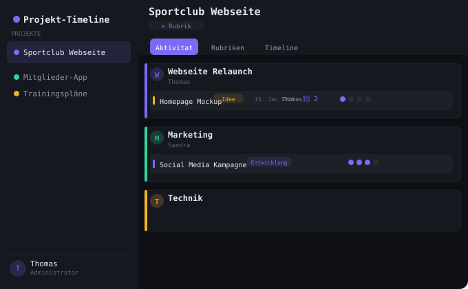
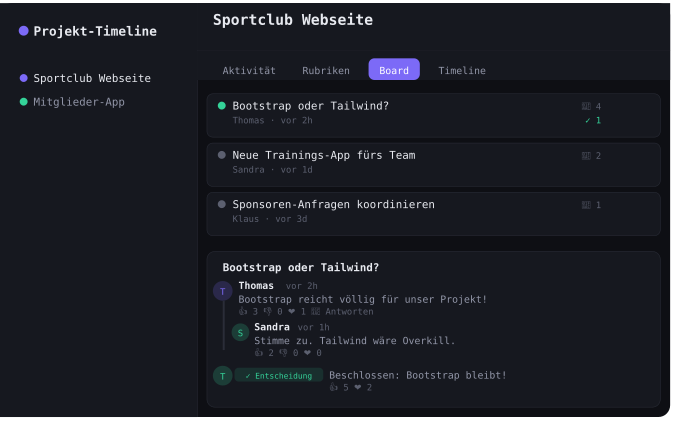
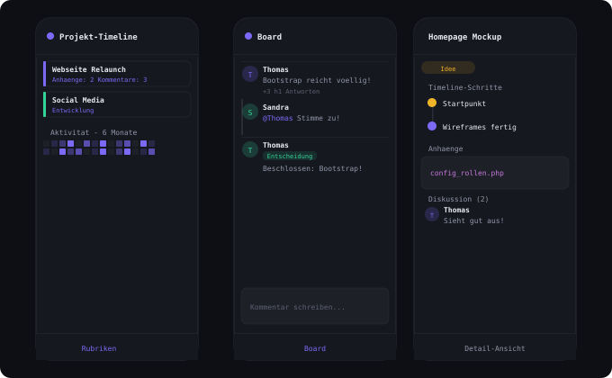
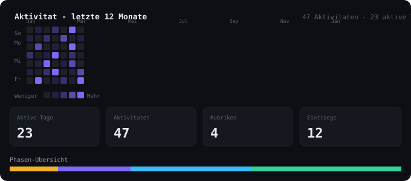
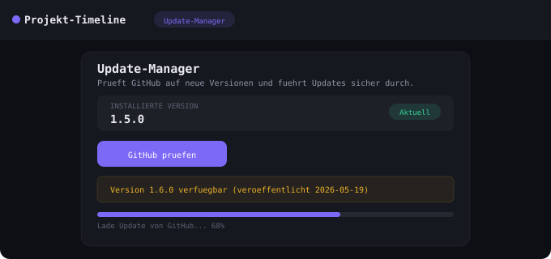
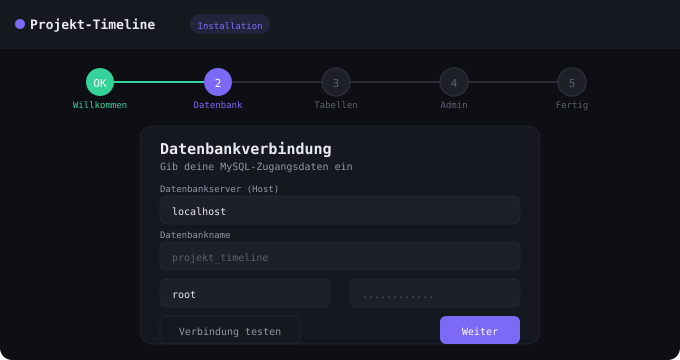
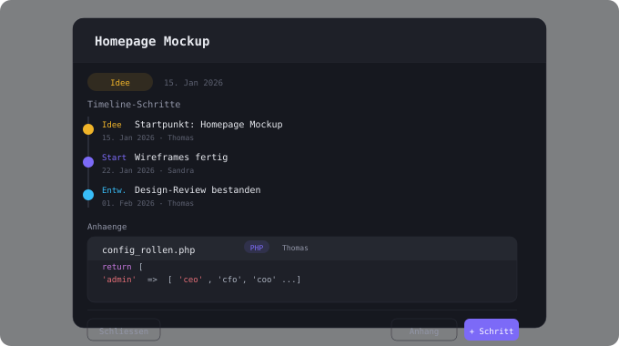

# Projekt-Timeline

<div align="center">


**Eine moderne, selbst gehostete Projektmanagement-App mit Team-Diskussionen, Code-Anhängen und automatischem Update-Manager.**

[Live-Demo](https://p-t.landofpixel.de) · [Installation](#installation) · [Update](#update) · [Features](#features)

</div>

---



---

## Schnellstart

```bash
# 1. Dateien hochladen
# 2. Installer aufrufen
https://deinedomain.de/projekt_timeline/install/

# 3. Datenbankdaten eingeben + testen
# 4. Admin-Konto anlegen
# 5. Fertig! 🎉
```

---

| **1.6.4** | 2026-05-23 | Board-Rechte feingranular, Cache-Busting, Bugfixes |
| **1.6.3** | 2026-05-21 | Board eigenständig, projektübergreifend, Ungelesen-Badge |
| **1.6.2** | 2026-05-19 | Board Mobile-Optimierung, Reddit-Style |

## Features

### Projekte & Rubriken
- Beliebig viele Projekte mit individueller Farbe
- Einträge mit 4 Phasen: 💡 Idee → 🚀 Start → ⚙️ Entwicklung → ✅ Abschluss
- Autorennamen bei Rubriken, Einträgen und Schritten

### 💬 Diskussions-Board
- Reddit-Style Baumstruktur mit unbegrenzter Tiefe
- Reaktionen: 👍 👎 ❤️ 🤔 pro Beitrag
- Entscheidungen markieren (grün hervorgehoben)
- Bidirektionale Kopplung: Board ↔ Rubrik / Eintrag / Schritt
- Aus Entscheidung direkt eine Rubrik erstellen

### 📊 Aktivitäts-Matrix
- GitHub-Style Heatmap
- Automatisch responsive: 6 / 12 / 24 Monate
- Statistik-Karten und Phasen-Übersicht

### 📎 Code-Anhänge
- Syntax-Highlighting für PHP, JS, HTML, CSS, SQL, JSON, Bash, Python
- Kopieren-Button + 📎 Indikator in der Eintragsliste

### 👥 Benutzerverwaltung
- 4 Rechtestufen: Lesen / Schreiben / Verwalten / Admin
- Projektzugang pro Benutzer konfigurierbar

### ⚙️ Komfort
- Hell/Dunkel-Modus pro Benutzer
- Automatischer Update-Manager mit GitHub-Integration
- Vollständig responsiv für Smartphone, Tablet, Desktop

---

## Screenshots

### Board — Reddit-Style Baumansicht



### Mobile-Ansicht



### Aktivitäts-Matrix



### Update-Manager



### Installations-Wizard



### Eintrag-Detail mit Code-Anhang



---

## Voraussetzungen

| Anforderung | Version |
|---|---|
| PHP | 7.1+ |
| MySQL / MariaDB | 5.7 / 10.3+ |
| Webserver | Apache oder Nginx |
| PHP-Erweiterungen | PDO, PDO_MySQL, ZipArchive |

---

## Installation

**1. Dateien hochladen** per FTP/SFTP.

**2. Installer aufrufen:**
```
https://deinedomain.de/install/
```

**3. Datenbankverbindung einrichten** — Host, Name, Benutzer, Passwort, Präfix.

**4. Tabellen werden automatisch angelegt** — alle 10 Tabellen.

**5. Admin-Konto erstellen.**

**6. Fertig** — `config.php` wird automatisch geschrieben und bei Updates nie überschrieben.

### Migration von 1.3.0

```
1. migrate.php ins Hauptverzeichnis hochladen
2. https://deinedomain.de/migrate.php aufrufen
3. Neue Dateien hochladen
4. migrate.php löschen!
```

---

## Update

```
install/ aufrufen
  → GitHub prüfen
  → Neue Version gefunden
  → Backup + Update klicken
    ① config.php → backups/
    ② Datenbank  → backups/
    ③ ZIP von GitHub laden
    ④ Dateien überschreiben
    ⑤ config.php bleibt unangetastet ✓
```

---

## Projektstruktur

```
projekt_timeline/
├── config.php              ← DB-Zugangsdaten (nie ins Repo!)
├── index.php
├── login.php
├── api.php                 ← Weiterleitung → src/api.php
├── version.json
├── src/                    ← PHP-Logik
│   ├── api.php
│   ├── auth.php
│   ├── db.php
│   ├── tbl.php             ← Tabellennamen
│   └── config.template.php
├── install/
│   └── index.php           ← Setup-Wizard & Update-Manager
├── assets/
│   ├── style.css
│   ├── css/login.css
│   └── js/
│       ├── config.js
│       ├── api.js
│       ├── auth.js
│       ├── sidebar.js
│       ├── matrix.js
│       ├── rubriken.js
│       ├── timeline.js
│       ├── board.js
│       ├── anhaenge.js
│       ├── diskussion.js
│       ├── detail.js
│       ├── modals.js
│       ├── crud.js
│       └── app.js
├── templates/
│   ├── header.php
│   └── footer.php
└── backups/
```

---

## Rechtesystem

| Aktion | lesen | schreiben | verwalten | admin |
|---|:---:|:---:|:---:|:---:|
| Projekt sehen | ✓ | ✓ | ✓ | ✓ |
| Einträge erstellen | — | ✓ | ✓ | ✓ |
| Board-Kommentare | — | ✓ | ✓ | ✓ |
| Entscheidungen markieren | — | — | ✓ | ✓ |
| Einträge löschen | — | — | ✓ | ✓ |
| Projekte verwalten | — | — | — | ✓ |
| Benutzer verwalten | — | — | — | ✓ |

---

## Datenbank-Tabellen

| Tabelle | Inhalt |
|---|---|
| `tl_projekte` | Projekte |
| `tl_benutzer` | Benutzer |
| `tl_projekt_benutzer` | Projektzugänge |
| `tl_rubriken` | Rubriken |
| `tl_eintraege` | Einträge |
| `tl_timeline_schritte` | Schritte |
| `tl_anhaenge` | Code-Snippets |
| `tl_kommentare` | Kommentare & Board-Beiträge |
| `tl_reaktionen` | Reaktionen |
| `tl_board_themen` | Board-Themen |

---

## Versionsverlauf

| Version | Datum | Highlights |
|---|---|---|
| **1.6.0** | 2026-04-22 | Reddit-Style Board, `src/` Struktur, `install/` Ordner |
| **1.5.0** | 2026-04-10 | Diskussions-Board, Baumstruktur, Board↔Rubrik Kopplung |
| **1.4.0** | 2026-04-05 | Kommentare & Reaktionen, Entscheidungen |
| **1.3.0** | 2026-04-01 | Syntax-Highlighting, Setup-Wizard, Update-Manager |
| **1.2.0** | 2026-03-20 | Modulares JS, Template-System |
| **1.1.0** | 2026-03-10 | Code-Anhänge, Responsive Matrix |
| **1.0.0** | 2026-03-01 | Basis-App, Benutzerverwaltung, Rechtesystem |

---

## Technologie-Stack

| Bereich | Technologie |
|---|---|
| Backend | PHP 7.1+, PDO |
| Datenbank | MySQL / MariaDB |
| Frontend | Bootstrap 5, Vanilla JavaScript ES6+ |
| Icons | Bootstrap Icons |
| Schriften | DM Sans, DM Serif Display |
| Syntax-Highlighting | highlight.js (atom-one-dark) |

---

<div align="center">
Entwickelt mit ❤️ und <a href="https://claude.ai">Claude.ai</a> (Anthropic)
</div>
